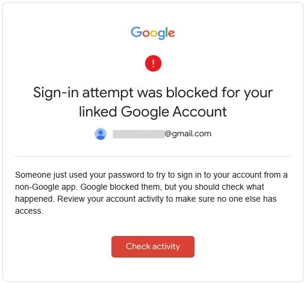
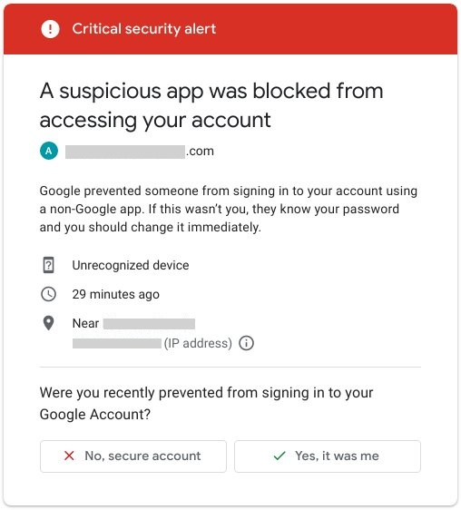
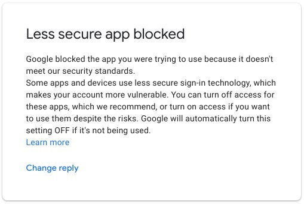

[](http://badge.fury.io/js/gmail-send)
[](https://travis-ci.org/alykoshin/gmail-send)
[](https://coveralls.io/github/alykoshin/gmail-send?branch=master)
[](https://codeclimate.com/github/alykoshin/gmail-send)
[](https://inch-ci.org/github/alykoshin/gmail-send)

[](https://david-dm.org/alykoshin/gmail-send#info=dependencies)
[](https://david-dm.org/alykoshin/gmail-send#info=devDependencies)

[](https://snyk.io/test/github/alykoshin/gmail-send)


# gmail-send

Minimalistic module to send emails using GMail (supports `Promise`)

Basically it's a wrapper around `nodemailer` package to simplify its usage for GMail accounts even more.

If you have different needs regarding the functionality, please add a [feature request](https://github.com/alykoshin/gmail-send/issues).


# Install

```bash
npm install --save gmail-send
```


# Prerequisites

### Preparation step - Configure your GMail account  

In order to send emails using GMail you need your account to be configured properly.

Its configuration depends on whether are you using two-step authentication or not.


#### Case 1: Your account is NOT configured to use two-step verification

In this case it is required to allow access to an account for "**less secure apps**".

Detailed step-by-step actions with sreenshots are described [here](./doc/configure-less-secure.md)


#### Case 2: Your account is configured to use two-step verification

Configure application-specific passwords for your GMail account
(if you are not using two-step verification, just skip this step and use same password you are using to login to GMail)

To be able send emails using GMail from any application (including Node.js) you need to generate application-specific password to access GMail:
[My Account](https://myaccount.google.com/) -> [Sign-in & security](https://myaccount.google.com/security) -> [Signing in to Google](https://myaccount.google.com/security#signin) -> [App passwords](https://security.google.com/settings/security/apppasswords?utm_source=OGB&pli=1)

Select 'Other (Custom name)' in 'Select app'/'Select device' drop-downs, enter descriptive name for your application and device and press 'GENERATE'.
Copy provided password.


# Quick start

1) Initialization: require the module and set defaults

```js
const send = require('gmail-send')({
  user: 'user@gmail.com',
  pass: 'abcdefghijklmnop',
  to:   'user@gmail.com',
  subject: 'test subject',
});
```

Now use it (callback way):
```js
send({
  text:    'gmail-send example 1',  
}, (error, result, fullResult) => {
  if (error) console.error(error);
  console.log(result);
})
```

If the callback is not provided, `send` function will return `Promise`.


# Usage

#### 1. Initializaton

```js
const send = require('gmail-send')(options);
```

- `options`   - mandatory - an object with following basic properties: 
  - `user`    - mandatory
  - `pass`    - mandatory
  - `to`      - mandatory - address as `string` or array of `string` addresses
                          you also may set array of recipients:
                          [ 'user1@gmail.com', 'user2@gmail.com ]
  - `from`    - optional  - by default equals to `user`
  - `replyTo` - optional - by default `undefined`
  - `subject` - optional - subject line
  - `text`    - optional - Plain text content
  - `html`    - optional - HTML content
  - `files`   - optional - array of files to attach
    - if particular filename in array is of `string` type, it is the filepath to attach
    - if it is an object `{ path, filename }` then:
      - `path`     - is the filepath to attach
      - `filename` - this value will be set as attachment filename in email
  ],
  
You may set also any option provided by `nodemailer` and it will be passed further, for example:  
  - bcc - optional - this option is not defined in `gmail-send` and will be passed to `nodemailer` unchanged

 
##### 2.1. Usage with callback

```js
send(options, callback);
```
- `options`  - optional
- `callback` - optional 
  `callback` takes 3 parameters:
   - error   - error object or `null`
   - result  - string response returned by Nodemailer (same as `full.response`)
   - full    - full result returned by Nodemailer

##### 2.2. Usage with `Promise`

If `callback` is not provided, `send` will return `Promise` which 
- resolves into `{ result, full }` object with properties same as in callback
- or rejects with error object. 


##### 2.2.1 `then`/`catch`

```js
send(options)
  .then(({ result, full }) => console.log(result))
  .catch((error) => console.error('ERROR', error))
  ;
```

##### 2.2.2. `async`/`await`

```js
try {
  const {result,full} = await send(options);
  console.log(result);
} catch(error) {
  console.error('ERROR', error);
}
```


# More examples

#### Example 1 - Callback way

```js
console.log('* [example 1]');

// Require'ing module and setting default options

const send = require('gmail-send')({
//const send = require('../index.js')({
  user: 'user@gmail.com',
  // user: credentials.user,               // Your GMail account used to send emails
  pass: 'abcdefghijklmnop',
  // pass: credentials.pass,               // Application-specific password
  to:   'user@gmail.com',
  // to:   credentials.user,               // Send to yourself
  //                                       // you also may set array of recipients:
  //                                       // [ 'user1@gmail.com', 'user2@gmail.com' ]
  // from:    credentials.user,            // from: by default equals to user
  // replyTo: credentials.user,            // replyTo: by default `undefined`
  
  // bcc: 'some-user@mail.com',            // almost any option of `nodemailer` will be passed to it
  //                                       // (but no any processing will be done on them)
  
  subject: 'test subject',
  text:    'gmail-send example 1',         // Plain text
  //html:    '<b>html text</b>'            // HTML
  // files: [ filepath ],                  // Set filenames to attach (if you need to set attachment filename in email, see example below
});


const filepath = './demo-attachment.txt';  // File to attach


console.log('* [example 1.1] sending test email');

// Override any default option and send email

send({ // Overriding default parameters
  subject: 'attached '+filepath,         // Override value set as default
  files: [ filepath ],
}, function (err, res, full) {
  if (err) return console.log('* [example 1.1] send() callback returned: err:', err);
  console.log('* [example 1.1] send() callback returned: res:', res);
  // uncomment to see full response from Nodemailer:
  // console.log('* [example 1.2] send() callback returned: full:', full);
});
//
// //  String result:
//
// * [example 1.1] sending test email
//
//
// // Full response (if uncommented):
//
// * [example 1.21] send() callback returned: err: null ; res: 250 2.0.0 OK  1234567890 1234567890abcde.67 - gsmtp ; full: {
//   1234567890 1234567890abcde.67 - gsmtp ; full: {
//   accepted: [ 'user@gmail.com' ],
//   rejected: [],
//   envelopeTime: 252,
//   messageTime: 1386,
//   messageSize: 678,
//   response: '250 2.0.0 OK  1234567890 1234567890abcde.67 - gsmtp',
//   envelope: { from: 'user@gmail.com', to: [ 'user@gmail.com' ] },
//   messageId: '<12345678-1234-1234-1234-12345678901@gmail.com>'
// }


console.log('* [example 1.2] sending test email');

// Set additional file properties

send({ // Overriding default parameters
  subject: 'attached '+filepath,              // Override value set as default
  files: [                                    // Array of files to attach
    {
      path: filepath,
      filename: 'filename-can-be-changed.txt' // You can override filename in the attachment if needed
    }
  ],
}, function (err, res, full) {
  if (err) return console.log('* [example 1.2] send() callback returned: err:', err);
  console.log('* [example 1.2] send() callback returned: res:', res);
  // uncomment to see full response from Nodemailer:
  // console.log('* [example 1.2] send() callback returned: full:', full);
});
//
// // String result:
//
// * [example 1.2] sending test email
//
//
// // Full response (if uncommented):
//`
// * [example 1.2] send() callback returned: err: null ; res: 250 2.0.0 OK  1234567890 1234567890abcde.67 - gsmtp ; full: {
//       accepted: [ 'user@gmail.com' ],
//       rejected: [],
//       envelopeTime: 239,
//       messageTime: 885,
//       messageSize: 694,
//       response: '250 2.0.0 OK  1234567890 1234567890abcde.67 - gsmtp',
//       envelope: { from: 'user@gmail.com', to: [ 'user@gmail.com' ] },
//       messageId: '<12345678-1234-1234-1234-12345678901@gmail.com>'
//     }
```

#### Example 2

You may also set all needed parameters at once and immediately send:

```js
console.log('* [example2] sending test email without checking the result');

//var send = require('gmail-send')({
require('../index.js')({
  user: credentials.user,           // Your GMail account used to send emails
  pass: credentials.pass,           // Application-specific password
  to:   credentials.user,           // Send to yourself
  subject: 'ping',
  text:    'gmail-send example 3',  // Plain text
})(()=>{});                         // Send email without any check
                                    //
                                    // Either callback function MUST be provided
                                    // or Promise rejection must be handled (see below)
//
// * [example2] sending test email without checking the result
//
```

You can find these working examples in `./demo/demo.js`.

You'll need to set your GMail user/pass in  `credential.json.example` and rename it to `credential.json` in order to run the example). sWhen credentials are set, run the application using `node demo/demo.js` or `node demo.js` depending on your current directory.


#### Example 3 - Promise way

If callback function is not provided, `send` function returns Promise. 
  
Instead of plain string response, Promise resolves to following object:
```js
{ 
  result: "string result", // same as full.response
  full:   { ... },         // full response from Nodemailer
}
```

```js
//
// Promise Example 1
// =================
console.log('* [promise-example-1] configuring');

// Require'ing module and setting default options

//var send = require('gmail-send')({
var send = require('../index.js')({
  user:    credentials.user,
  pass:    credentials.pass,
  to:      credentials.user,
  subject: 'test subject',
  text:    'gmail-send promise examples',
});


// Send email

console.log('* [promise-example-1] sending');

const result = send() // Using default parameters
  .then((res) => {
    console.log('* [promise-example-1] then: res.result:', res.result);
    // full response from Nodemailer:
    // console.log('* [promise-example-1] then: res.full:', res.full);
  })
  .catch((error) => {
    console.log('ERROR:', error);
    console.log('* [promise-example-1] catch: error:', error);
  })
;


console.log('* [promise-example-2] sending');

const asyncAwaitSend = async() => {
  try {
    const res = await send(); // Using default parameters
    console.log('* [promise-example-2] res.result:', res.result);
    // uncomment to see full response from Nodemailer:
    // console.log('* [promise-example-2] res.full:', res.full);
  } catch (e) {
    console.error('* [promise-example-2] ERROR:', e);
  }
};
asyncAwaitSend();
```


# Troubleshooting

#### 1. Critical security alert message to your linked account 

If you receive message with the subject "**Critical security alert for your linked Google Account**
" to your email account linked to the one you are trying to use:


You may click 'Check activity', check information to ensure it was yours attepmt and confirm it by clicking on 'Yes, it was me' button.



But if you are not using two-step verification even now you still need to enable access for less-secure app (see preparation steps above).



 

#### 2. "Invalid login" error when not using two-steps verification
 
If you receive following error response when trying to send email:
```
submitOrder: assistant email: user@gmail.com
* gmailSend: ERROR: Error: Invalid login: 535-5.7.8 Username and Password not accepted. Learn more at
535 5.7.8  https://support.google.com/mail/?p=BadCredentials v15sm6024371lfd.53 - gsmtp
...
  code: 'EAUTH',
  response: '535-5.7.8 Username and Password not accepted. Learn more at\n' +
    '535 5.7.8  https://support.google.com/mail/?p=BadCredentials v15sm6024371lfd.53 - gsmtp',
  responseCode: 535,
  command: 'AUTH PLAIN'
}
```
In this case (as suggested by the [link provided in this response](https://support.google.com/mail/?p=BadCredentials)) you need to: 
1) check your username/password 
2) ensure you allowed less secure application access if you are not using two-steps verification. 


## Credits
[Alexander](https://github.com/alykoshin/)


## Links to package pages:

[github.com](https://github.com/alykoshin/gmail-send) &nbsp; [npmjs.com](https://www.npmjs.com/package/gmail-send) &nbsp; [travis-ci.org](https://travis-ci.org/alykoshin/gmail-send) &nbsp; [coveralls.io](https://coveralls.io/github/alykoshin/gmail-send) &nbsp; [inch-ci.org](https://inch-ci.org/github/alykoshin/gmail-send)


## License

MIT
