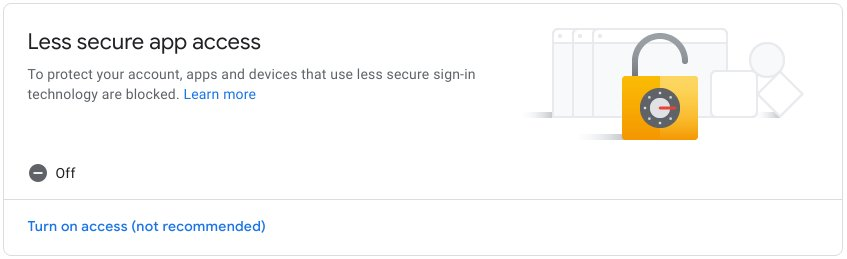
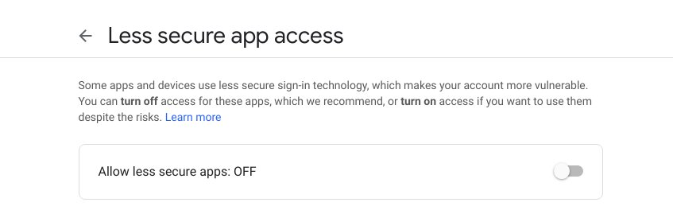
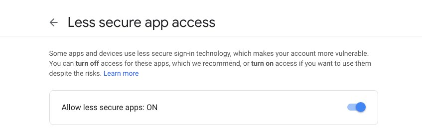

### Preparation step - Configure your GMail account  

#### Case 1: Your account is NOT configured to use two-step verification

In this case it is required to allow access to an account for "**less secure apps**".

To do this follow these steps:
[My Account](https://myaccount.google.com/) -> [Sign-in & security](https://myaccount.google.com/security) -> 

Now scroll down to `Less secure app access` section. This is how it looks when access is off:

-> Click on [Turn on access](https://myaccount.google.com/u/1/lesssecureapps)

Set the switch for 'Allow less secure app' to 'ON'. 

This is how it looks when access is off:

This is a proper position for the switch:

If you don't see this setting, your administrator might have turned off less secure app account access (applicable if you are using GMail for Business). 

You may find more info on "Less secure apps" here: https://support.google.com/accounts/answer/6010255, but basically this is how Google names all the apps using traditional SMTP/POP3 protocols when 2-step verification is disabled.
